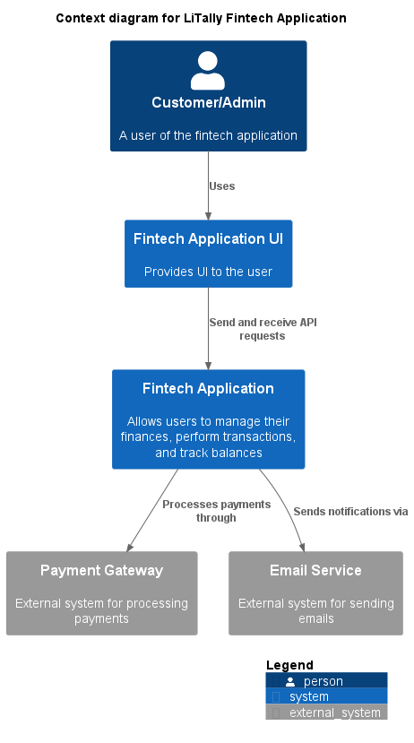
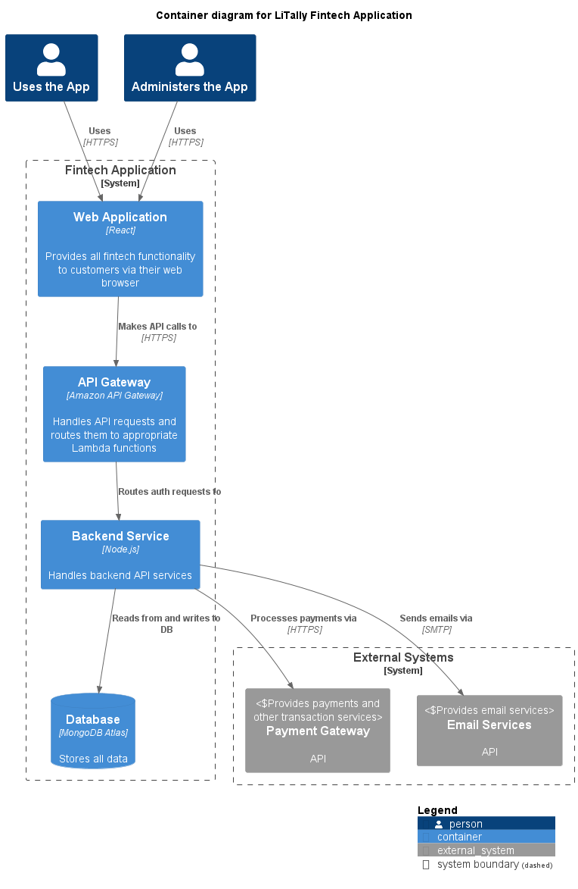
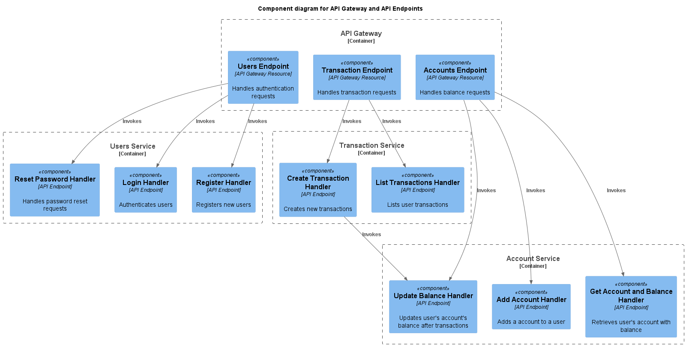
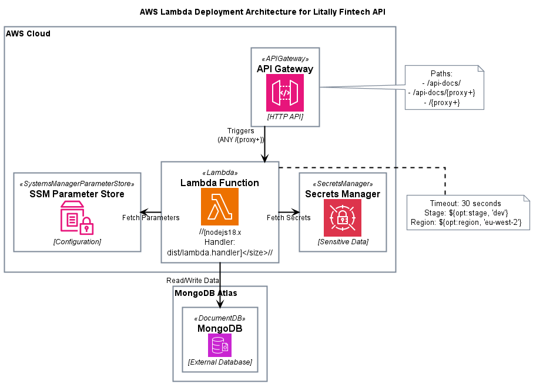
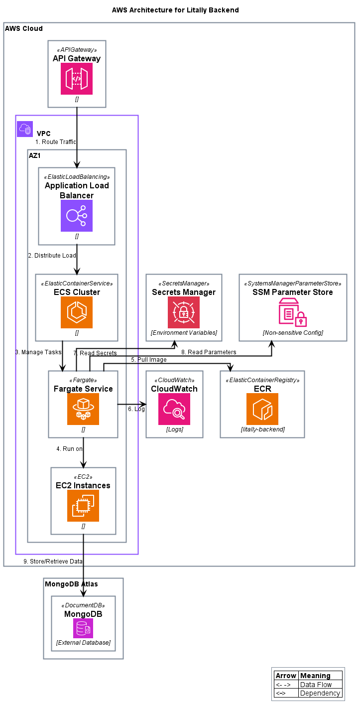

# Architecture for LiTally Fintech App

This document consists of the architecture of the basic app.

The diagrams are draws usng [PlantUML](https://plantuml.com) and [C4 Model](http://c4model.com) is used for visualising the architecture.

## Table of Contents
- [Architecture for LiTally Fintech App](#architecture-for-litally-fintech-app)
  - [Table of Contents](#table-of-contents)
  - [Context](#context)
  - [Container](#container)
  - [Component](#component)
  - [Network Design - AWS](#network-design---aws)
  - [Database Design](#database-design)
    - [Users Collection](#users-collection)
    - [Accounts Collection](#accounts-collection)
    - [Transactions Collection](#transactions-collection)
  - [Security Considerations](#security-considerations)
  - [API Design](#api-design)

## Context

The app is a simple Fintech app that enables users to register/login and perform transactions.



1. The customer accesses the app via a UI (frontend or via `/api-doc` - a swagger-ui).
2. The UI in turn talks to the API server or `backend`
3. The API server also communicates to a payment gateway (mocked) and email server (not integrated/implemented).

All the data in the app is stored in a database (MongoDB)

## Container

The following is the container diagram showing different systems in the app.



1. User uses an App UI (React App or Swagger UI)
2. UI talks to the backend via an API gateway (AWS API Gateway)
3. The API Gateway then talks to the backend running on Lambda or ECS
4. The data is stored in MongoDB Atlas
5. External systems include (a mock payment gateway)

## Component

The component diagram provides different components in the app. This is a simple app, complex component diagram is in [Scalability Document](./SCALABILITY.md)



The compnent diagram only lists the interactions between API Gateway and API Services. Interactions between the services and database are not listed here as all services talk to the database.

1. Users Endpoint:
   1. Registers user
   2. Logs in users
   3. Authorizes the token sent in the API call
   4. Lists all users (in case of admin)
2. Accounts Endpoint:
   1. Creates an account
   2. Lists all accounts of a user
   3. Provides details of an account including the balance
3. Transactions Endpoint:
   1. Creats a transaction
   2. Lists all transactions of an account


## Network Design - AWS

Network diagram for Lambda is as follows:</br>



The network diagram for ECS + Fargate is as follows:</br>



## Database Design

The database has 3 collections:</br>
1. Users - Stores user information including login credentials
2. Accounts - A user can have multiple accounts and accounts stores balances
3. Transactions - Transactions happen on accounts and there are types(`CREDIT`, `DEBIT`) and sub-types (`DEPOSIT`, `PAYMENT`, `CASH WITHDRAWAL` etc) of a transaction

### Users Collection

The users collection holds basic users data with `email` as login and hashed `password`.

The schema is as follows:

```
  "User": {
    "_id": "ObjectId",
    "email": "String",
    "passwordHash": "String",
    "firstName": "String",
    "lastName": "String",
    "userType": "String"
    "createdAt": "Date",
    "updatedAt": "Date"
  },
```

There are 2 types of users:
1. CUSTOMER
2. ADMIN

Customers can login, view their accounts and balances and credit or debit from an account. Can also see list of transactions of a given account.

Admins can do all the tasks of a customer, additionally, they can view all users, their accounts, balances and details. They can also change status of a transaction. Currently status of only `PENDING` transactions can be changed. `FAILED` transaction status cannot be changed.

For testing purposes, if the amount is `2.71` the transaction goes into `PENDING` state. If the amount is `3.14` the transaction goes into `FAILED` state.

### Accounts Collection

A user can have multiple accounts. Each account has its own currency (currency validation is not implemented)

The schema is as follows:

```
  "Account": {
    "_id": "ObjectId",
    "userId": "ObjectId",
    "accountType": "String",
    "accountName": "String",
    "currency": "String",
    "balance": "Number",
    "isActive": "Boolean",
    "createdAt": "Date",
    "updatedAt": "Date"
  },

```

Balances of an account change on adding transactions.
There is a special api called `updateBalance`, that adds (subtracts in case of negative amount) to an existing balance.

### Transactions Collection

An account has multiple transaction. A transaction updates an account's balance depending on the type of transaction.

Currently there are only 2 types: `CREDIT` and `DEBIT`.

A transaction also has sub-type, that enables extending the main type of transactions to give more details, like `PAYMENT`, `CASH WITHDRAWAL`, `DEPOSIT` etc.

The schema of transactions is as follows:

```
  "Transaction": {
    "_id": "ObjectId",
    "accountId": "ObjectId",
    "type": "String",
    "amount": "Number",
    "currency": "String",
    "description": "String",
    "status": "String",
    "createdAt": "Date",
    "updatedAt": "Date"
  }
```

A transaction calls speaks to a dummy `Payment Gateway`, that always returns `SUCCESS` except in 2 scenarios:
1. Amount = `2.71` - Transaction is in pending state
2. Amount = `3.14` - Transaction will fail

An API is provided to the `ADMIN` for updating the status of a transaction, only `PENDING` transactions can be updated. Once a transaction state changes from `PENDING` to `COMPLETED`, then the transaction goes through.

## Security Considerations

Security was not given any importance in the design. Only out of the box security features were used.

The following are the known gross security misses:

1. HTTPS was not used
2. The API is exposed to the external world
3. The database is exposed to the external world
4. No security testing was performed

## API Design

OpenAPI 3.0 is used for documenting the APIs. The backend provides `/swagger.json` a json of the API doc and `/api-doc` a SwaggerUI of the apis. The `/api-doc` can act as a API client for developers and has support for AuthN/AuthZ 

The API documentation is as follows: [Swagger Editor](https://editor.swagger.io) can be used for better visualization.

```
openapi: 3.0.1
info:
  title: LiTally Fintech API
  version: 1.0.0
  description: API documentation for LiTally Fintech application
servers:
  - url: http://localhost:3000
    description: Local server
  - url: http://localhost:3000
    description: Explicit Local Server
components:
  securitySchemes:
    bearerAuth:
      type: http
      scheme: bearer
      bearerFormat: JWT
security:
  - bearerAuth: []
paths:
  /api/accounts:
    post:
      summary: Create a new account
      tags:
        - Accounts
      security:
        - bearerAuth: []
      requestBody:
        required: true
        content:
          application/json:
            schema:
              type: object
              required:
                - accountType
                - accountName
                - currency
              properties:
                accountType:
                  type: string
                accountName:
                  type: string
                currency:
                  type: string
      responses:
        '201':
          description: Account created successfully
        '400':
          description: Invalid input
        '401':
          description: Unauthorized
    get:
      summary: Get user's accounts
      tags:
        - Accounts
      security:
        - bearerAuth: []
      responses:
        '200':
          description: User's accounts retrieved successfully
        '401':
          description: Unauthorized
  /api/accounts/{accountId}:
    get:
      summary: Get account details
      tags:
        - Accounts
      security:
        - bearerAuth: []
      parameters:
        - in: path
          name: accountId
          required: true
          schema:
            type: string
      responses:
        '200':
          description: Account details retrieved successfully
        '401':
          description: Unauthorized
        '404':
          description: Account not found
  /api/accounts/{accountId}/balance:
    put:
      summary: Update account balance
      tags:
        - Accounts
      security:
        - bearerAuth: []
      parameters:
        - in: path
          name: accountId
          required: true
          schema:
            type: string
      requestBody:
        required: true
        content:
          application/json:
            schema:
              type: object
              required:
                - amount
              properties:
                amount:
                  type: number
      responses:
        '200':
          description: Account balance updated successfully
        '400':
          description: Invalid input
        '401':
          description: Unauthorized
        '404':
          description: Account not found
  /api/accounts/{accountId}/transactions:
    get:
      summary: Get account's transactions
      tags:
        - Accounts
      security:
        - bearerAuth: []
      parameters:
        - in: path
          name: accountId
          required: true
          schema:
            type: string
      responses:
        '200':
          description: Account's transactions retrieved successfully
        '401':
          description: Unauthorized
  /api/accounts/{accountId}/deactivate:
    put:
      summary: Deactivate account
      tags:
        - Accounts
      security:
        - bearerAuth: []
      parameters:
        - in: path
          name: accountId
          required: true
          schema:
            type: string
      responses:
        '200':
          description: Account deactivated successfully
        '401':
          description: Unauthorized
        '404':
          description: Account not found
  /api/transactions:
    post:
      summary: Create a new transaction
      tags:
        - Transactions
      security:
        - bearerAuth: []
      requestBody:
        required: true
        content:
          application/json:
            schema:
              type: object
              required:
                - accountId
                - type
                - amount
                - currency
                - description
              properties:
                accountId:
                  type: string
                type:
                  type: string
                  enum:
                    - CREDIT
                    - DEBIT
                amount:
                  type: number
                currency:
                  type: string
                description:
                  type: string
                subType:
                  type: string
      responses:
        '201':
          description: Transaction created successfully
        '400':
          description: Invalid input
        '401':
          description: Unauthorized
  /api/transactions/{transactionId}:
    get:
      summary: Get transaction details
      tags:
        - Transactions
      security:
        - bearerAuth: []
      parameters:
        - in: path
          name: transactionId
          required: true
          schema:
            type: string
      responses:
        '200':
          description: Transaction details retrieved successfully
        '401':
          description: Unauthorized
        '404':
          description: Transaction not found
  /api/transactions/account/{accountId}:
    get:
      summary: Get account's transactions
      tags:
        - Transactions
      security:
        - bearerAuth: []
      parameters:
        - in: path
          name: accountId
          required: true
          schema:
            type: string
      responses:
        '200':
          description: Account's transactions retrieved successfully
        '401':
          description: Unauthorized
  /api/transactions/{transactionId}/status:
    put:
      summary: Update transaction status (Admin only)
      tags:
        - Transactions
      security:
        - bearerAuth: []
      parameters:
        - in: path
          name: transactionId
          required: true
          schema:
            type: string
      requestBody:
        required: true
        content:
          application/json:
            schema:
              type: object
              required:
                - status
              properties:
                status:
                  type: string
                  enum:
                    - COMPLETED
                    - FAILED
      responses:
        '200':
          description: Transaction status updated successfully
        '400':
          description: Invalid input
        '401':
          description: Unauthorized
        '403':
          description: Forbidden - Admin access required
        '404':
          description: Transaction not found
  /api/users/register:
    post:
      summary: Register a new user
      tags:
        - Users
      requestBody:
        required: true
        content:
          application/json:
            schema:
              type: object
              required:
                - email
                - password
                - firstName
                - lastName
              properties:
                email:
                  type: string
                password:
                  type: string
                firstName:
                  type: string
                lastName:
                  type: string
      responses:
        '201':
          description: User registered successfully
        '400':
          description: Invalid input
  /api/users/login:
    post:
      summary: Login user
      tags:
        - Users
      requestBody:
        required: true
        content:
          application/json:
            schema:
              type: object
              required:
                - email
                - password
              properties:
                email:
                  type: string
                password:
                  type: string
      responses:
        '200':
          description: Login successful
        '401':
          description: Invalid credentials
  /api/users/profile:
    get:
      summary: Get user profile
      tags:
        - Users
      security:
        - bearerAuth: []
      responses:
        '200':
          description: User profile retrieved successfully
        '401':
          description: Unauthorized
    put:
      summary: Update user profile
      tags:
        - Users
      security:
        - bearerAuth: []
      requestBody:
        required: true
        content:
          application/json:
            schema:
              type: object
              properties:
                firstName:
                  type: string
                lastName:
                  type: string
      responses:
        '200':
          description: Profile updated successfully
        '400':
          description: Invalid input
        '401':
          description: Unauthorized
  /api/users:
    get:
      summary: Get all users (Admin only)
      tags:
        - Users
      security:
        - bearerAuth: []
      responses:
        '200':
          description: List of all users retrieved successfully
        '401':
          description: Unauthorized
        '403':
          description: Forbidden - Admin access required
  /api/users/{userId}/type:
    put:
      summary: Update user type (Admin only)
      tags:
        - Users
      security:
        - bearerAuth: []
      parameters:
        - in: path
          name: userId
          required: true
          schema:
            type: string
      requestBody:
        required: true
        content:
          application/json:
            schema:
              type: object
              required:
                - userType
              properties:
                userType:
                  type: string
                  enum:
                    - CUSTOMER
                    - ADMIN
      responses:
        '200':
          description: User type updated successfully
        '400':
          description: Invalid input
        '401':
          description: Unauthorized
        '403':
          description: Forbidden - Admin access required
        '404':
          description: User not found
tags: []

```