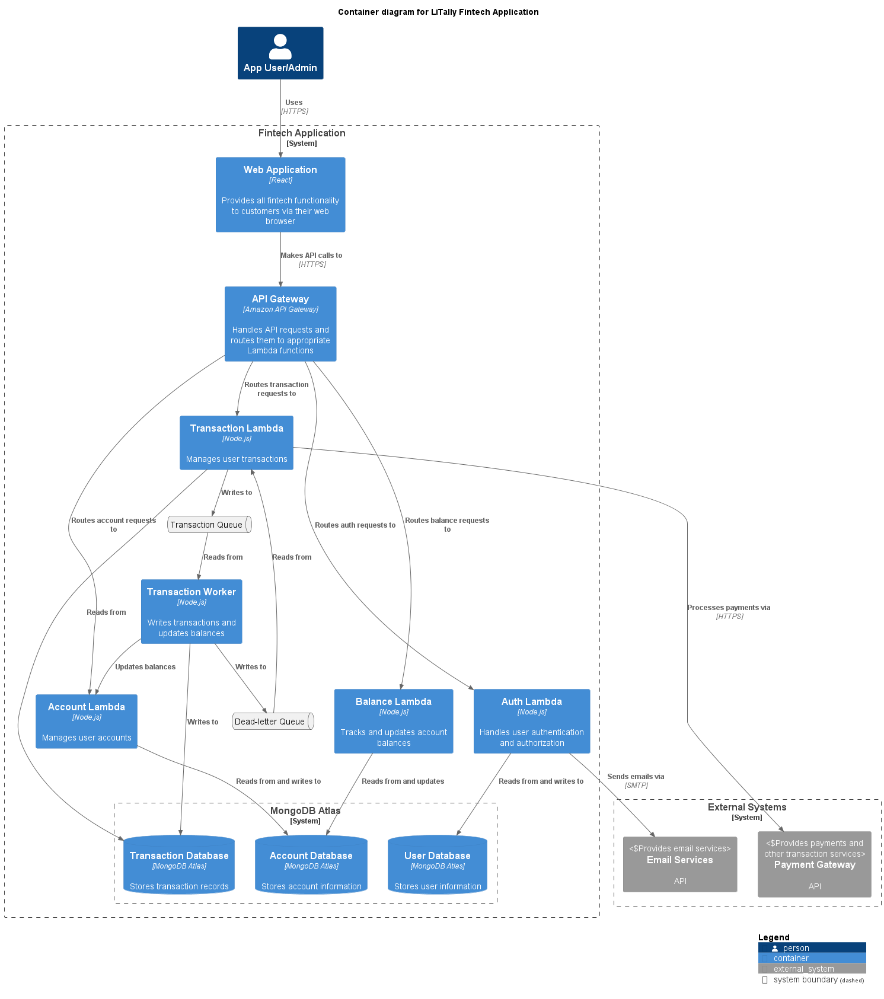

# Operational strategy and Scaling LiTally Fintech App

The document discusses about operational strategy and scaling the current LiTally Fintech App.

>Assumption: The context of the app remains unchanged. Only the number of users who use the app will grow

## Table of Content

- [Operational strategy and Scaling LiTally Fintech App](#operational-strategy-and-scaling-litally-fintech-app)
  - [Table of Content](#table-of-content)
  - [Operational Strategy](#operational-strategy)
    - [Logging and Tracing](#logging-and-tracing)
    - [Monitoring and Alerts](#monitoring-and-alerts)
      - [Key Metrics to Monitor:](#key-metrics-to-monitor)
      - [Alert Setup:](#alert-setup)
    - [Backup Strategy](#backup-strategy)
      - [MongoDB Atlas Backup:](#mongodb-atlas-backup)
      - [Application Data Backup:](#application-data-backup)
  - [Scaling Considerations](#scaling-considerations)
    - [Lambda Functions](#lambda-functions)
    - [Application-Level Scaling](#application-level-scaling)
    - [Microservices for increased complexity](#microservices-for-increased-complexity)
    - [MongoDB Atlas](#mongodb-atlas)
 

## Operational Strategy

### Logging and Tracing

The app uses basic logging and writes into CloudWatch logs.

For tracing, we can rely AWS X-Ray or Open tracing.

Tracing can be implemented using:
1. Instrumenting Lambda Functions
   1. Enable AWS X-Ray tracing for all Lambda functions
   2. Add custom subsegments for critical code paths
2. API Gateway: Enable X-Ray for API Gateway
3. Database calls
4. Custom annotations and meta data: Business relevant information and additional context
5. Sampling rules: custom sampling rules for high value transactions. Reduced sampling for high volume, low-priority requests
6. Service Map: Visualize the flow and identify bottlenecks. Instana provides this out of the box

### Monitoring and Alerts

We will utilize AWS CloudWatch to set up comprehensive monitoring and alerting. This will help us maintain high availability, performance, and security. Alternatively, third party tools like DataDog, Instana etc can be used, but overall the metrics and setup remains similar.

#### Key Metrics to Monitor:

**API Gateway:**

1. Request count
2. Latency
3. 4XX and 5XX error rates

**Lambda Functions:**

1. Invocation count
2. Duration
3. Error count
4. Throttles

**MongoDB Atlas:**

1. CPU utilization
2. Memory usage
3. Connection count
4. Disk I/O

**Custom Application Metrics:**

1. User login attempts (successful and failed)
2. Transaction volume and value
3. Account creation rate

#### Alert Setup:

1. Set up CloudWatch Alarms for:
   1. API Gateway 5XX errors exceeding 1% of total requests in 5 minutes
   2. Lambda function error rate exceeding 2% in 5 minutes
   3. MongoDB Atlas CPU utilization exceeding 80% for 10 minutes

2. Configure SNS (Simple Notification Service) to send alerts via:
   1. Email to the operations team
   2. SMS for critical alerts
   3. Integration with incident management tools (e.g., PagerDuty)

3. Implement a dashboard in CloudWatch for real-time monitoring of key metrics.

### Backup Strategy

To ensure data integrity and quick recovery in case of failures, a robust backup strategy ise needed for both MongoDB Atlas and application data (if any e.g: documents, monthly reports etc.).

#### MongoDB Atlas Backup:

**Continuous Backup:**

1. Enable continuous backup feature in MongoDB Atlas
2. Set retention period to 7 days for point-in-time recovery

**Daily Snapshots:**

1. Configure daily snapshots of the entire database
2. Retain snapshots for 30 days

**Cross-Region Backup:**

Enable cross-region backup to a secondary AWS region for disaster recovery

**Monthly/Quarterly/Annual Backups**

To be retained as per jurisdictional needs (5 years), store them to AWS S3 Glacier.

#### Application Data Backup:

**S3 Bucket for Config and User Files:**

1. Store application configuration files and user files in an separate S3 buckets
2. Enable versioning on the S3 bucket

**Lambda Function Code:**

1. Use GitHub for version control
2. Implement CI/CD pipeline using GitHub actions for automated backups of each deployment and containers.

**Infrastructure as Code:**

1. Store CDK file in GitHub repository
2. Backup templates to S3 bucket after each successful deployment using GitHub actions

## Scaling Considerations

Geographical Scaling is not considered and is out of scope of this document. 

Multifaceted scaling approach using cloud provider's native scaling strategies aka simple scaling are detailed below

### Lambda Functions

1. Concurrency:
   1. Set appropriate reserved concurrency for critical functions
   2. Utilize provisiond concurrency for functions with cold start sensitivity
2. Function Configuration:
   1. Optimize memory allocation based on function requirements
   2. Implement async patterns for non-critical, time-consuming operations

### Application-Level Scaling

1. Caching:
   1. Implement application cache like Redis for frequently accessed data
   2. Use API Gateway caching for repetitive requests
2. Ansynchronous Processing:
   1. Utilize queues like SQS for queueing background jobs
   2. Implement event-driven architectures using queues for decoupling services (eg. transactions)
3. Content Delivery: Use CDN for static assets and API response caching

### Microservices for increased complexity

As functionality becomes complex, the size requirements for Lambda increases, which will in-turn affect the performance and QoS.
1. Split the code into different micro services with dedicated databases.
2. Deploy these services in separate Lambdas or dedicated ECS clusters
3. API gateway can be utilized to redirect APIs to these services

### MongoDB Atlas

1. Vertical Scaling: Monitor performance and uupgrade to larger instance types as needed
2. Horizontal Scaling:
   1. Implement sharding of collections with high write volumes
   2. Add read replicas to distribute read operations
3. Microservices: each service will have its dedicated database that can be scaled vertically/horizontally as per service needs

